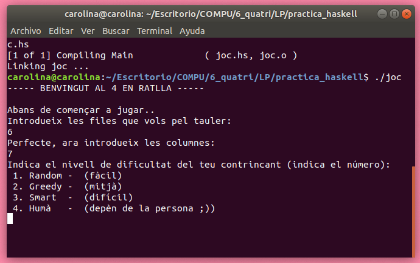
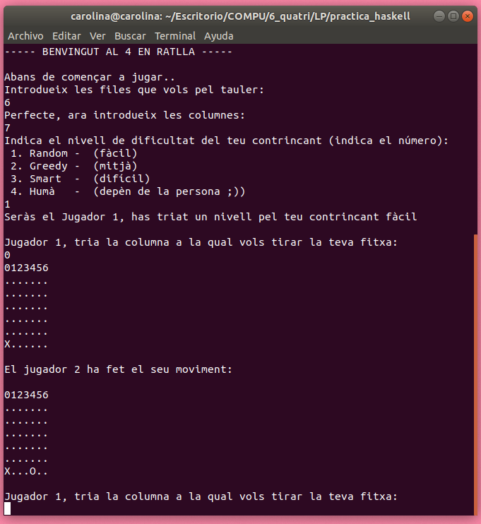

# 4 en ratlla
## Carolina Middel Soria
## LP, Curs 2019-2020


## Aquest és un joc on pots jugar contra una IA molt tonta, normaleta o molt intel·ligent, tu tries! El joc consta d'un tauler de 6×7, és a dir, 6 files i 7 columnes, en el qual has d'al·linear quatre fitxes consecutives d'un mateix color, el teu, per guanyar. Molta sort!


### Començant
La compilació i execució del codi es podrà fer amb la comanda `ghc joc.hs` la qual generarà un execuble, que després podrem executar amb la comanda: `./joc`.

### Codi
En aquest apartat explicaré les diferents funcions del codi:

#### randInt :: Int -> Int -> IO Int
Funció que faig servir per a generar números random (extreta de l'enunciat).
- pre: rebem els números delimitador del random que volem generar, min i max, respectivament.
- post: retorna el numero random generat.

#### imprimir_int:: Int -> Int -> IO Int
Funció que imprimeix Ints
- pre: rebem un contador a 0 i el número màxim al qual volem arribar.
- post: imprimim cada Int fins que el contador sigui igual al número màxim.

#### transposar_f_c :: Tauler -> Tauler
Funció que transposa la matriu (tauler) per a poder treballar las columnes com a files (i així tenir-les per llistes), aixo ho faig fent una llista de tots els primers elements de les llistes concatenada amb els següents de manera que files i colunes queden invertides.
- pre: rebem el tauler files x columnes.
- post: s'obté el tauler que teniem abans però en format columnes x files.

#### diagonals_tauler :: Tauler -> Tauler
Aquesta funció s'encarrega de donar-me totes les diagonals del meu tauler. De manera que les files del tauler que retorna son les diagonals del tauler original. Exemple de representació gràfica:

```
1 2 3
4 5 6
7 8 9

->

1 2 3
 * 4 5 6
 *  * 7 8 9
 
I aixi serà el tauler que s'obté

1 * *
2 4 *
3 5 7
6 8
9

```

- pre: rebem el tauler original.
- post: obtenim una matriu (tauler) en el qual les files representen les diagonals (cap un costat) i per obtenir les altres haurem de fer un reverse del tauler original abans de passar-li.

#### buscar_buit :: [Char] -> Int -> Int
Funció que utilitzo per a buscar la posició buida a la que hi ha d'anar la fitxa segons la columna que trii per tirar. El que fa bàsicament és buscar la primera posició buida (amb '.') i anar incrementant la variable posició mentres avança.
- pre: entra la columna a la qual volem tirar la fitxa i un Int que serà la variable on guardarem la posició.
- post: treu la posició de la columna on anirà la fitxa.

#### busca_pos :: Int -> Tauler -> Int
Funció complementada amb l'esmentada anteriorment, aquesta és lencarregada de passar la columna seleccionada per l'usuari o la IA a la funció buscar_buit.
- pre: número de la columna a la cual volem tirar la fitxa i el tauler.
- post: posició de la columna indicada, que representa on caura la fitxa.

#### remplaza :: Jugador -> Int -> [Char] -> [Char] -> [Char]
Funció que substitueix la nova columna amb el valor que s'ha de canviar (inserció de la fitxa).
- pre: entres el jugador el qual esta jugant aquest torn per a marcar el char correcte, la posició que es vol remplaçar, la llista que representara la nova columna, i la columna original
- post: un cop acaba s'obté la columna amb el valor de la fitxa a la posició marcada actualitzat

#### remplaza_mat :: Jugador -> Int -> Int -> Tauler -> Tauler -> Tauler
Crea un nou tauler amb la fitxa que s'ha tirat en aquest torn actualitzada, treballa amb la funció anterior.
- pre: entra el jugador del torn actual, un contador, la posició que s'ha d'actualitzar, el tauler que representarà el tauler final (primerament buit) i el tauler original.
- post: obtenim el tauler amb la fitxa actualitzada

#### comprova_linia :: [Char] -> Jugador -> Int -> Int -> Int
Comprova quantes fitxes seguides del jugador indicat hi ha a la llista indicada per saber si aquest ha guanyat o té un número de fitxes consecutives de 3 o 2 (usat en greedy i smart).
- pre: fila, columna o diagonal representada per llista de Char, jugador del torn actual i contador, i el número que marcarà l'èxit, normalment 4 per a fer 4 en ratlla (excepte per el greedy i smart que es farà servir per veure quantes fitxes consecutives tenim).
- post: número de fitxes seguides

#### comprova_guanyador :: Tauler -> Jugador -> Int -> Bool
Comprova si el jugador ha guanyat o té el numeró de fitxes consecutives indicat.
- pre: el tauler, jugador, i la cuantitat de fitxes consecutives que volem comprovar que es troben.
- post: Bool, que indicarà true si el jugador ha guanyat (o té el número de fitxes consecutives demanat).

#### comprova_guanyador_h_v_d :: Tauler -> Jugador -> Int -> Bool
Comprova si el guanyador ha guanyat per fila, columna i diagonals. Bàsicament el unic que fa es cridar 4 cops la funció esmentada anteriorment i retornar el seu resultat.

#### limits :: Tauler -> Int -> Bool
Comprova que es compleixin els limits del tauler, és a dir que no es tiri a una columna que no existeix, i que es tira a una columna que no està plena.
- pre: entra el tauler, i la columa a la qual es vol tirar
- post: boolea que t'indica True si estàs dins dels limits i False si per contrari, no ho estàs.

#### tauler_ple :: Tauler -> Bool
Funció que comprova si el tauler està ple i per tant s'ha donat un empat.
- pre: tauler de la jugada feta
- post: si el tauler està ple retorna True, sinó False


### Estratègies

#### Greedy

- Cada tirada de l'ordinador és a la columna que li permet posar en ratlla el nombre més alt de fitxes pròpies.
- Evita (si pot) que el contrari faci 4-en-ratlla a la jugada següent.
- I en cas d'empat, tria arbitràriament.


#### Smart

- Cada tirada de l'ordinador és a la columna que li permet posar en ratlla el nombre més alt de fitxes pròpies o tallar el nombre més alt de fitxes pròpies de l'oponent només quan està arribant a 3 fitxes consecutives. (És a dir que si l'ordinador no pot arribar a 3 fitxes consecutives però per el contrari l'oponent si, el tallarà abans de tirar per ell poder aconseguir 2 consecutives).
- Evita (si pot) que el contrari faci 4-en-ratlla a la jugada següent.
- I en cas d'empat, tria arbitràriament.


### Exemples
L'execució del joc és molt intuïtiva, el programa començarà de la següent manera:



I seguidament un cop triada la dificultat de la IA amb la qual vols jugar, ja podràs començar a jugar:




### Author
Carolina Middel Soria
